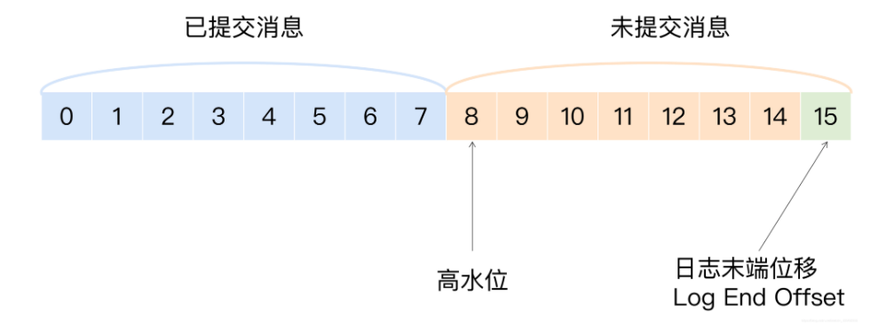
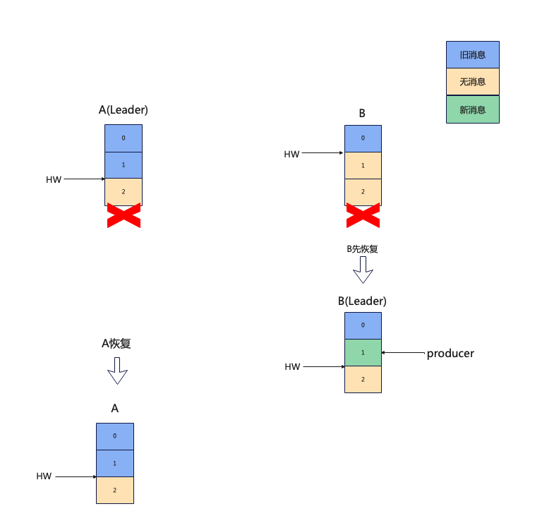

# 多副本机制

## 高水位和日志末端位移

数据一致性是分布式系统需要去解决的问题。

在Kafka中，消息日志(LogSegment)是需要严格保证不能丢失的，所以Kafka用了很多机制去尽可能的保证消息的不丢失，比如Producer的重试，Ack确认机制等。其中最为核心的就是多副本(Replica)机制，而多副本机制也是分布式系统中很常见的一种保证数据一致性的方案。

在创建topic时，可以指定创建的topic的Partition数和Replica数，其中replica的数量就是一个分区要做几个副本，通俗的来讲，一个Replica就是一份数据的备份。分区所有的Replica分为一个Leader Replica和多个Follower Replica，其中Leader负责对外提供日志段的读写，而Follower只负责不断的从Leader中同步数据，这个同步的动作叫做Fetch，Follower需要严格保证和leader之间的数据一致性，当Leader在某个时间崩溃或者宕机时，kafka会在Follower之中选出一个作为新的Leader对外提供服务，这样可以保证系统的高可用。但是如果Follower没有完全同步Leader的日志数据，消费者就无法从新的Leader中消费到没有同步的数据了，就发生了消息的丢失。

Kakfa中关于副本有两个重要的概念: 高水位(HW)和日志末端位移Log End Offset(LEO)

<figure><figcaption></figcaption></figure>

这张图片描述了这两个概念在LogSegment中的位置。

简单做个概念的解释，高水位之前的消息日志是已经确认完成副本同步的，可以直接被消费者消费。反之高水位后的消息日志还未被所有副本同步，还无法被消费。而LEO则代表了下一条消息写入的位移，也就是说图中的15还并没有消息，只是待写入状态。

## HW和LEO的更新时机

HW和LEO是LogSegment级别的概念，因此Leader和Follower端都会有这两个概念，为了更方便的管理Follower Replica的状态，Leader端Broker会保存一份所有Follower Replica的LEO，称为Remote Follower LEO，下面就Leader HW Leader LEO Remote Follower LEO，Follower HW, Follower LEO这五个概念及其更新时机做一个介绍

Leader HW

```
Leader HW在很多场景会尝试更新，这里只讨论两种:
1. 处理Producer请求时
2. 处理Fetch请求时
在处理这两种请求时，Leader Replica会在Leader Broker保存的所有Follower replica列表中最小的
LEO也就是Remote Follower LEO和Leader LEO二者的最小值作为新的Leader HW
```

Leader LEO

```
Leader LEO在处理Producer请求时，往底层Log写入消息时会去更新Leader LEO
```

Remote Follower LEO

```
Remote Follower LEO在源码中是一个Map,key是replica id,value是对应replica的LEO，
在Leader处理Fetch请求时，请求中会带有Follower的Fetch Offset，在Leader Response之前，
会用这个Fetch Offset去更新Remote Follower LEO
```

Follower LEO

```
在接收到Fetch请求的响应时，在将消息写入Log后更新Follower LEO
```

Follower HW

```
在接收到Fetch请求的响应时，取min(Leader HW, Follower LEO)作为新的Follower HW
```

## Fetch请求及问题

介绍了HW和LEO的更新时机后，我们用一轮流程来分析Fetch请求的处理过程

<figure><figcaption></figcaption></figure>

最开始没有任何消息，所以LEO和HW都为0

<figure><figcaption></figcaption></figure>

生产者发送了一条消息，Leader副本处理produce请求，往Log底层写入日志，此时更新Leader LEO为1

Follower发送第一轮Fetch请求，fetch offset为0，此时Leader中有一条消息可以被拉取，此时Leader会去尝试更新Remote Follower LEO为fetch offset，所以还是0，而此时虽然Leader LEO是1，但是Remote Follower LEO依旧为0，所以Leader HW还是0。所以Leader会返回Leader HW=0给Follower。

Follower收到响应后，会将Fetch到的消息写入到Log底层，并更新Follower LEO为1，而因为返回的Leader HW还是0，所以此时Follower HW并不会做更新。

这里可以看到，在producer写入消息后，第一轮Fetch请求虽然Follower将消息同步过来了，但是Leader HW和Follower HW并没有做更新。

Follower发起第二轮Fetch请求，此时Follower LEO已经被更新成了1，所以fetch offset=1，Leader Replica并没有任何消息可以被拉取，因此Leader LEO不会更新。Remote Follower LEO更新成fetch offset=1，此时Leader LEO和Remote Follower LEO都是1，所以Leader HW会被更新成1并返回给Follower，Follower收到响应后会将Follower HW更新成1。至此所有LEO和HW都更新完成。

我们可以发现，第一轮Fetch同步了消息，但是HW是第二轮Fetch才完成的，那么如果第一轮完成以后，因为某些原因Follower无法发起第二次Fetch请求，会不会有问题呢？

答案是会的，我们看下面这两种场景:

### 消息丢失

<figure><figcaption></figcaption></figure>

完成第一轮Fetch请求后，日志已经同步到Follower了，但是此时Follower副本所在的Broker重启了，此时Follower HW=0，在副本B重启后，会去做副本恢复工作，此时发现Follower HW=0,而Follower LEO=1,副本B会主动进行日志截断操作，将日志截断到高水位，也就是offset=1的日志会被丢弃。

此后如果副本B正常发起第二轮Fetch请求，Follower依旧可以正常将Leader的消息同步过来并正常更新HW，但是此时Leader A恰好宕机了，Controller会发起副本选举操作，副本B成为了新的Leader。

在副本A作为Follower恢复以后，副本A会进行日志截断，offset=1的日志会被丢弃，就造成了offset=1的消息完全丢失了。

### 数据不一致

<figure><figcaption></figcaption></figure>

现在一个分区有多个副本，且生产者ack=1，即只要有一个副本完成日志的写入就可以返回成功。此时Leader副本A有两条消息\<m0,m1>,Leader HW=1，Follower副本B有一条消息 \<m0>。

由于某些原因，所有副本都崩溃重启，B先恢复过来成为新的Leader，此时分区HW=0无需进行日志截断，随后B作为Leader处理了来自生产者的请求，将消息写入LogSegment并将分区HW更新为1。

这个时候A恢复了，成为了Follower，向B发起Fetch发现分区HW=1，而此时B的LEO=1，不需要做日志截断且fetch offset=1不会从B拉取到offset=1的消息。最后A和B都正常工作，但是实际保存的消息却出现了不一致的情况。

## Leader Epoch

上述的两种问题，最根本的原因就是副本消息的备份是同步完成的，但是高水位的更新却需要在下一轮的Fetch请求中更新，而日志的截断依据是HW，因此一旦更新HW之前发生任何崩溃都有可能造成消息的丢失或者不一致。

为了解决这两种问题，Kafka在0.11版本引入了Leader Epoch机制。

所谓的Leader Epoch其实就是一对键值对\<epoch, offset>,epoch就是一个版本号，每次有Leader的选举变更这个epoch值就是+1，而offset代表epoch对应的副本成为Leader时写入的第一条消息的位移。

假设有两对键值对<0,0>, <1, 100>

这两对键值对代表的含义就是第一个Leader副本从offset=0开始写入消息，写入了\[0,99]的消息后，发生了Leader变更，新的Leader从offset=100处开始写消息。

Leader Epoch会定时写入到Leader副本所在的Broker checkPoint文件中，并且每个副本都会将epoch键值对缓存到自身的broker中。

**每次副本恢复过来以后，不会马上根据HW做日志截断，而是先发起OffsetForLeaderEpochRequest给Leader副本，请求参数中带有Follower副本当前的Epoch值，Leader副本接收到请求后，会将自身的LEO以及Follower Epoch + 1的epoch值对应的startOffset返回给Follower副本，此后Follower副本根据返回的startOffset值判断是否做日志截断操作。**

## Fetch请求处理过程

请求入口在KafkaApis中:

```
case ApiKeys.FETCH => handleFetchRequest(request)
```

handleFetchRequest中通过fetchMessages方法来处理

```
replicaManager.fetchMessages(
    fetchRequest.maxWait.toLong,
    fetchRequest.replicaId,
    fetchMinBytes,
    fetchMaxBytes,
    versionId <= 2,
    interesting,
    replicationQuota(fetchRequest),
    processResponseCallback,
    fetchRequest.isolationLevel,
    clientMetadata)
}
```

fetchMessages方法最重要的参数是interesting参数，它的签名是

```
fetchInfos: Seq[(TopicPartition, PartitionData)]
```

interesting的赋值来自于:

```
fetchContext.foreachPartition { (topicPartition, data) =>
  if (!metadataCache.contains(topicPartition))
    erroneous += topicPartition -> errorResponse(Errors.UNKNOWN_TOPIC_OR_PARTITION)
  else
    interesting += (topicPartition -> data)
}
```

这段代码的作用是，将FetchRequest的请求参数封装成了{TopicPatition:PartitionData}的格式，而PartitionData中包含了本次Fetch请求的一些Follower Replica的信息，PartitionData有几个重要的属性

```
long fetchOffset;  //follower请求fetch位移
long logStartOffset;
int maxBytes;
Optional<Integer> currentLeaderEpoch; //follower当前的epoch
Optional<Integer> lastFetchedEpoch; // 上一次fetch的epoch
```

这些属性会用于Leader Replica的消息拉取判断以及LEO、HW的更新等。

下面我们一点一点的来剖析fetchMessages方法。

首先，会判断本次Fetch请求是来自于Consumer还是Follower，二者的拉取行为对于Leader来说是不同的，也会做不同的处理,因为本文只做副本相关的研究，因此只关注follower的请求处理。

```
val isFromFollower = Request.isValidBrokerId(replicaId)
val isFromConsumer = !(isFromFollower || replicaId == Request.FutureLocalReplicaId)
```

然后，Leader就开始从底层的LogSegment读取消息了:

```
val logReadResults = readFromLog()
```

```
def readFromLog(): Seq[(TopicPartition, LogReadResult)] = {
  val result = readFromLocalLog(
    replicaId = replicaId,
    fetchOnlyFromLeader = fetchOnlyFromLeader,
    fetchIsolation = fetchIsolation,
    fetchMaxBytes = fetchMaxBytes,
    hardMaxBytesLimit = hardMaxBytesLimit,
    readPartitionInfo = fetchInfos,
    quota = quota,
    clientMetadata = clientMetadata)
  if (isFromFollower) updateFollowerFetchState(replicaId, result)
  else result
}
```

readFromLog方法做了两件事情

* 读取消息日志
* 更新follower的Fetch状态

读取消息日志的部分，进行了多层封装，最终会调用到Partition.scala类的readRecords方法

```
def readRecords(lastFetchedEpoch: Optional[Integer],
                fetchOffset: Long,
                currentLeaderEpoch: Optional[Integer],
                maxBytes: Int,
                fetchIsolation: FetchIsolation,
                fetchOnlyFromLeader: Boolean,
                minOneMessage: Boolean): LogReadInfo = inReadLock(leaderIsrUpdateLock) {
  // decide whether to only fetch from leader
  val localLog = localLogWithEpochOrException(currentLeaderEpoch, fetchOnlyFromLeader)
  val initialHighWatermark = localLog.highWatermark
  val initialLogStartOffset = localLog.logStartOffset
  val initialLogEndOffset = localLog.logEndOffset
  val initialLastStableOffset = localLog.lastStableOffset

  lastFetchedEpoch.ifPresent { fetchEpoch =>
    val epochEndOffset = lastOffsetForLeaderEpoch(currentLeaderEpoch, fetchEpoch, fetchOnlyFromLeader = false)
    val error = Errors.forCode(epochEndOffset.errorCode)
    if (epochEndOffset.leaderEpoch < fetchEpoch || epochEndOffset.endOffset < fetchOffset) {
      val emptyFetchData = FetchDataInfo(
        fetchOffsetMetadata = LogOffsetMetadata(fetchOffset),
        records = MemoryRecords.EMPTY,
        firstEntryIncomplete = false,
        abortedTransactions = None
      )
      val divergingEpoch = new FetchResponseData.EpochEndOffset()
        .setEpoch(epochEndOffset.leaderEpoch)
        .setEndOffset(epochEndOffset.endOffset)
      return LogReadInfo(
        fetchedData = emptyFetchData,
        divergingEpoch = Some(divergingEpoch),
        highWatermark = initialHighWatermark,
        logStartOffset = initialLogStartOffset,
        logEndOffset = initialLogEndOffset,
        lastStableOffset = initialLastStableOffset)
    }
  }
  val fetchedData = localLog.read(fetchOffset, maxBytes, fetchIsolation, minOneMessage)
  LogReadInfo(
    fetchedData = fetchedData,
    divergingEpoch = None,
    highWatermark = initialHighWatermark,
    logStartOffset = initialLogStartOffset,
    logEndOffset = initialLogEndOffset,
    lastStableOffset = initialLastStableOffset)
}
```

这个方法很长，看似做了非常多的事情，但是很多都是一些非正常逻辑的处理。真正我们需要关注的，其实就两个地方

1. 检查leaderEpoch的合法性并查出当前Partition对应的LogSegment
2. 调用read方法，按照offset从LogSegment读取消息

readRecords方法所做的工作就是从日志底层读取出可以被Fetch的消息。这里有一个值得关注的变量fetchIsolation,这个变量代表读取日志的方式

```
sealed trait FetchIsolation
case object FetchLogEnd extends FetchIsolation
case object FetchHighWatermark extends FetchIsolation
case object FetchTxnCommitted extends FetchIsolation
```

读取日志的方式有三种，读到日志末端位移、读到高水位线、读已提交事务消息

第三种是kafka消息事务的概念，这里不做介绍。前面两种对应了两种不同的读取消息场景。

对于Follower端发起的Fetch请求，会读到日志末端位移，因为所有被写入Leader副本的消息，都需要被同步。

对于Consumer端的消费请求(sync=all)，会读到高水位线，因为高水位线以上的消息还未被所有follower同步，暂时不能被消费。

日志的读取不是本文的重点，接下来我们重点看一下Fetch请求中，各种HW和LEO是如何被更新的，这一点决定了Kafka副本机制的安全性。

回到readFromLog方法，readFromLocalLog执行完后，紧接着执行了这样一行

```
if (isFromFollower) updateFollowerFetchState(replicaId, result)
```

这行代码字面意义非常清晰，如果是来自follower replica的请求，则需要去更新FollowerFetch的一些状态，这些状态包括上面提到的Leader HW、Remote LEO、Follower LEO等。

进入updateFollowerFetchState方法一直进到Partition类里的

```
def updateFollowerFetchState(followerId: Int,
                             followerFetchOffsetMetadata: LogOffsetMetadata,
                             followerStartOffset: Long,
                             followerFetchTimeMs: Long,
                             leaderEndOffset: Long): Boolean = {
  getReplica(followerId) match {
    case Some(followerReplica) =>
      followerReplica.updateFetchState(
        followerFetchOffsetMetadata,
        followerStartOffset,
        followerFetchTimeMs,
        leaderEndOffset)
      //.......
      val leaderHWIncremented = if (prevFollowerEndOffset != followerReplica.logEndOffset) {
        inReadLock(leaderIsrUpdateLock) {
          leaderLogIfLocal.exists(leaderLog => maybeIncrementLeaderHW(leaderLog, followerFetchTimeMs))
        }
      } 
  }
}
```

这里面做了几件事

1. 通过follower replica id从remote follower map中找到对应的remote follower replica
2. 更新remote follower replica的LEO
3. 尝试更新Leader HW

前面提到过，Leader副本端broker保存了一份所有ISR中的follower replica的LEO，我把它叫做remote follower LEO，在代码里它其实是一个map结构，key是replica id,value是follower replica的一些包括LEO在内的一些元数据信息。

getReplica就是通过本次Fetch请求的follower replica id从map里找到对应的follower。

找到follower以后，就用follower replica中的fetchOffset更新对应的follower LEO。

前面提到过，Leader HW是整个分区的HW，它决定了所有Consmuer和Follower的Fetch，在处理完Produce请求和Fetch请求时，Leader都需要去尝试更新Leader HW。下面我们一起看看这个神秘的Leader HW是如何被更新的

```
private def maybeIncrementLeaderHW(leaderLog: Log, curTime: Long = time.milliseconds): Boolean = {
  var newHighWatermark = leaderLog.logEndOffsetMetadata
  remoteReplicasMap.values.foreach { replica =>
    if (replica.logEndOffsetMetadata.messageOffset < newHighWatermark.messageOffset &&
      (curTime - replica.lastCaughtUpTimeMs <= replicaLagTimeMaxMs || isrState.maximalIsr.contains(replica.brokerId))) {
      newHighWatermark = replica.logEndOffsetMetadata
    }
  }

  leaderLog.maybeIncrementHighWatermark(newHighWatermark) match {
    case Some(oldHighWatermark) =>
      true
  }
}
```

这里用到了一个简单的排序算法，从所有副本中选出最小的一个LEO作为新的HW。

然后拿这个新的HW尝试去更新LogSegment对应的HW。

最后，核心流程都已经处理完成，Leader将HW等信息返回给Follower并完成本次Fetch请求。
