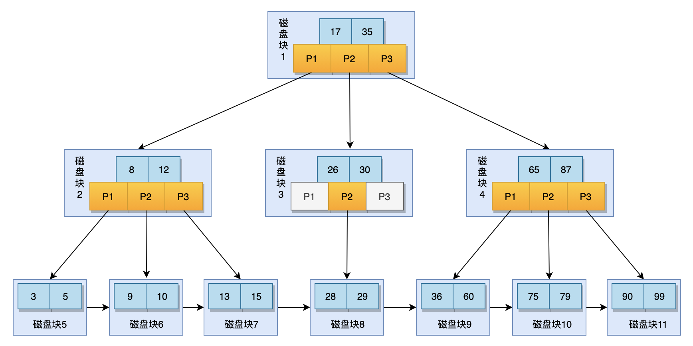

# 索引

## 文件IO

在操作系统中，文件是保存在磁盘上的。CPU并不能直接访问磁盘，如果需要进行文件的读写，需要将磁盘中的文件加载到内存中，才能被CPU访问。

由于读写磁盘的速度比读写内存要慢很多（DDR4 内存读写速度是机械硬盘500倍，是固态硬盘的200倍），如果对于磁盘的访问是随机的，那这个速度会差十万倍以上。

对于一些数据存储类的中间件来说，需要频繁的读写文件，如果每次读取数据都需要去访问磁盘，那么系统就很容易达到瓶颈，因此很多中间件都会通过一些优化尽可能的减少磁盘的访问次数，如Kafka中使用FileChannel、使用PageCache等。

同样在Mysql中，索引是减少磁盘访问的最有效核心的机制。

## What is a Index

索引(Index)在日常生活中有着非常广泛的使用，例如字典的目录、购物网站的分类等。索引的作用在于，不断缩小查找的范围，把随机的查找变成顺序的查找，提高查找的效率。

不同的查询场景适合不同的索引结构，一旦索引的数据结构设计的不合理，就很容易使得数据变得倾斜，索引的效率渐渐的趋近于随机查询。Mysql中查询的场景非常复杂，不仅仅有"="查询，还有范围查询，所以合适的索引数据结构变得尤为重要。

假设我们用二叉搜索树来构建索引。二叉搜索树的性质的左子树的值永远小于右子树，查询复杂度为lgN，效率不错，并且数据的倾斜问题也可以通过树的旋转来达到平衡。

看似二叉搜索树很适合作为索引结构，但是对Mysql而言它却有一个致命的问题:一旦表中的数据量够大并且区分度足够高，二叉搜索树的高度将非常高，而每一个索引节点都需要进行一次磁盘io，前面我们介绍过，磁盘io效率非常低，因此树的高度太高，将会进行很多次磁盘io，效率非常低。


## 索引的结构

分析完二叉搜索树，我们大致知道什么样的数据结构适合来构建Mysql的索引了:索引的节点层数尽可能的少并且要满足范围查询的场景。Mysql的索引功能由存储引擎来提供，不同的存储引擎有不同的索引结构，本文中重点介绍InnoDB引擎的B+树结构。

B+树是一种高度可控的多路搜索树，其结构如下:

<figure><figcaption><p>B+树结构</p></figcaption></figure>

Mysql中B+树有几点重要的性质

1. 只有叶子节点会保存真实的业务数据，非叶子节点只存储虚拟的索引项
2. 所有叶子节点进行进行排序，并且建立了指针
3. 如果是联合索引，则会根据字段顺序排序后建立索引

如果要查找60这个数据项，B+树的查询有哪些过程呢？

1. 将磁盘块1加载到内存，通过比较定位到P3指针，指向磁盘块4
2. 将磁盘块4加载到内存，通过比较定位到P1指针，指向磁盘块9
3. 将磁盘块9加载到内存，在数据页内通过二分法定位到60数据项

在所有索引项都没有页缓存的情况下，三层B+树一次数据查找进行了三次磁盘io，而三层B+树可以表示上百万的数据，三次磁盘io的成本相对低很多，如果没有索引需要进行百万次的io，性能差距非常大。

通过上面的分析，可以得到一个结论，mysql的磁盘io次数取决于B+树的高度H,假设一张表的数据量是N,一个数据页的数据项数量为m,可以得到一个关系

$$
H =log_{m+1}N
$$

在数据量一定的情况下，m越大H越小，而m = 数据页大小 / 数据项大小，数据页的大小是一定的，所以数据项越小m越大，B+树的高度越小，发生的磁盘io次数越少。

这带给我们一些索引运用时的一些启示，建立索引时，尽量选择内存占用少的字段，如用int代替bigint。这也解释了为什么B+树的非叶子结点不存储真实数据项，应尽量减小数据项的大小。

InnoDB索引的核心在于B+树的结构和性质，如果能理解清楚B+树，所有索引的原理也就水到渠成了。

\
聚簇索引
----

InnoDB根据索引的类型是不是主键分为主键索引和非主键索引，也称为聚簇索引和辅助索引。在索引的结构层面二者的区别在于，聚簇索引的叶子结点存储的是一行数据记录，而辅助索引存储的是该索引字段的数据项对应的主键。

举个例子，现在有一张学生表，id为主键，name建立索引。

```sql
create table student (
  id int primary key ,
  name varchar(255) not null,
  age int not null,
  index(name)
)
```

通过name来查询学生信息

```sql
select * from student where name = 'jack'
```

查询的过程就如下图所示

<figure><figcaption></figcaption></figure>

首先会走name索引，在name索引的B+树中找到name='jack'的叶子节点，由于是非聚簇索引，该叶子节点上存储的就是索引字段(name)+主键字段(id)，找到对应的id后，再进一步去主键id的索引(聚簇索引)上查找id对应的记录，最终返回id,name,age字段。

我们可以看到:

**一次索引查询往往是两次B+树的查找过程，每次查询都需要先查索引项找到对应的主键，再通过主键找到完整的数据项。这个再次在聚簇索引中查找完整数据项的过程叫做回表。**

知道回表的概念以后，结合上面提到的索引原理，我们可以分析出一些索引使用需要注意的地方。

* 通过非聚簇索引查询往往需要回表，聚簇索引使用频率非常高，因此聚簇索引应该尽量的有序，占用更小的内存
* 回表会多一次B+树的搜索，在不影响业务的情况下，应该尽量避免回表的发生，如上述的查询学生信息，如果只需要查询学生的name和id，不需要年龄的情况下，可以只查询这两个字段，由于这两个字段在辅助索引的叶子节点已经存在，就不需要额外去聚簇索引搜索了。这种方式也叫做覆盖索引。


