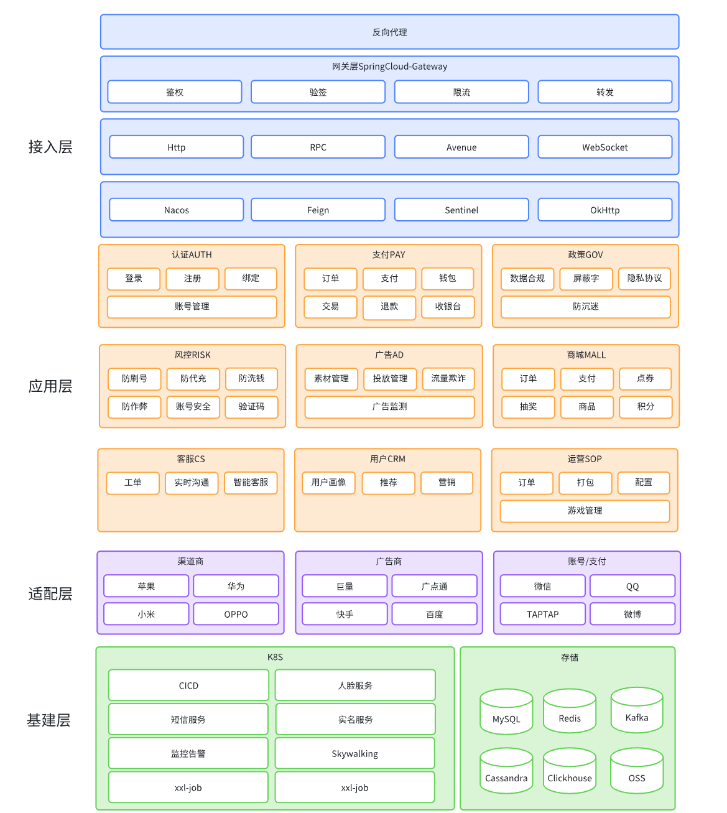

# 广告投放总览

## 生态

<figure><figcaption></figcaption></figure>

1、在广告生态通常有四大角色：

a. 广告主：拥有需推广产品或服务的企业或个体，需要自行或者委托他人设计、制作和发布广告，以吸引流量

b. 广告商：提供制作和发布广告服务的单位，一般有自建的物理平台或虚拟平台，直接服务流量群体

c. 广告监测：对接广告商的广告投放数据和广告主的业务数据，打通投放的完整链路，实时分析广告效果，以便实时投放策略调整和长期投放规划

d. 广告情报：以中立的身份提供行业广告的大盘洞察，包括创意数据、厂商数据、行业分析等等\

2、上述提到的四大角色中，广告主和广告商不是绝对的，在某些情况下，广告主也会扮演广告商的角色，广告商也会扮演广告主的角色，比如：抖音在各大应用商城进行推广，即是做为广告主的角色，而游戏在抖音上推广，此时抖音则是做为广告商的角色

3、广告监测做为广告投放中的重要的一环，做为市场营销人员的重要支撑工具，通常有以下三种形式存在：

&#x20;      a. 广告商提供：是和特定广告商绑定的，只有考虑使用一家广告商或者无任何研发资源的企业/个体(比如卖货主播)使用

&#x20;      b. 广告主提供：适用有较强研发能力，且对商业数据有保密要求的广告主

&#x20;      c. 第三方提供：这种是以牺牲商业数据为代价获取相关支撑能力的，适用于弱研发能力或者刚起步的企业

4、广告监测更深一步的功能是反作弊，有效监测出广告商或第三方恶意刷广告的行为，为广告主降低投放成本，提高投放效率

5、广告情报，推测服务提供商采集数据的方式有两种：

&#x20;      a. 爬虫抓取：

&#x20;               a-1. 部分广告商平台对部分广告提供了无门槛可见的数据，比如：排名、下载量、预约量等

&#x20;               a-2. 可通过抓取该类数据进行聚合分析

&#x20;               a-3. 此类数据由于无去重依据，数据可靠性偏低

&#x20;      b. 打点代码植入：

&#x20;               b-1. 目前主流的服务提供商均提供创意素材服务

&#x20;               b-2. 广告主使用服务提供商提供的创意素材，该素材可植入代码，获取展示、点击等数据

&#x20;               b-3. 不适用于静态素材，如文案、图片、gif等，更多的可能是基于落地页、下载短链等

\

## 投放人员视角

<figure><figcaption></figcaption></figure>

一次投放活动的流程简述如下：

1、市场人员通过投放管理功能创建投放

&#x20;     (1) 规划投放

&#x20;     (2) 生成媒体包

&#x20;     (3) 创建广告组、广告计划、广告创意

2、市场人员开始或更新投放

&#x20;     (1) 媒体上广告展示

3、媒体系统和投放系统数据交互

4、投放系统进行归因计算，生成效果数据

6、市场人员查看数据展示，分析投放效果

7、市场人员根据分析结果，调整投放策略

8、投放过程在2\~7不断迭代优化直至投放活动结束
